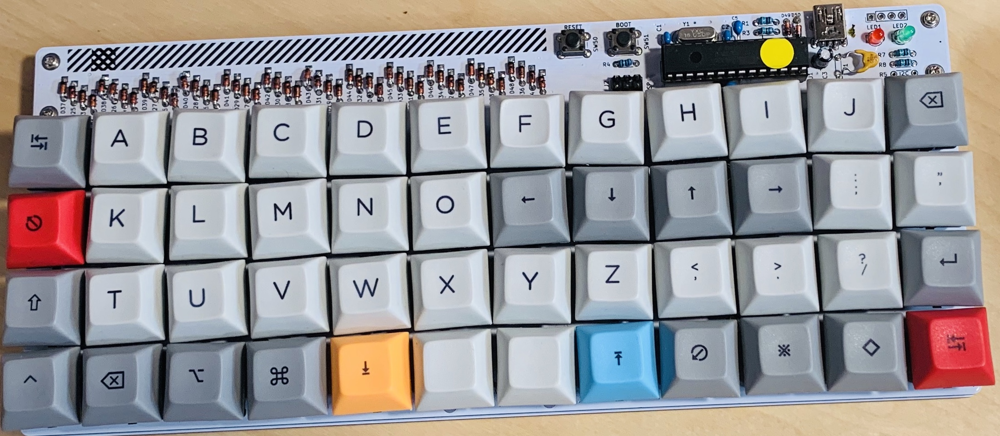

Plaid
===============

The 4x12 ortholinear keyboard kit made by through hole components only. 

Cherry MX Brown switches [Cherry Browns at KBDfans](https://kbdfans.com/collections/cherry-switches/products/switch-68-cherry-gateron-zealio?variant=40117059533)

DSA dye sub 40% layout keycaps [DSA 40% at KBDfans](https://kbdfans.com/collections/dsa-profile/products/dsa-dye-sub-40layout-keycaps)

Atmega328p with VUSB on [QMK firmware](https://github.com/qmk/qmk_firmware).

[Build guide and bom is here](./doc)
[ビルドガイドとパーツリストはこちら](./doc)
