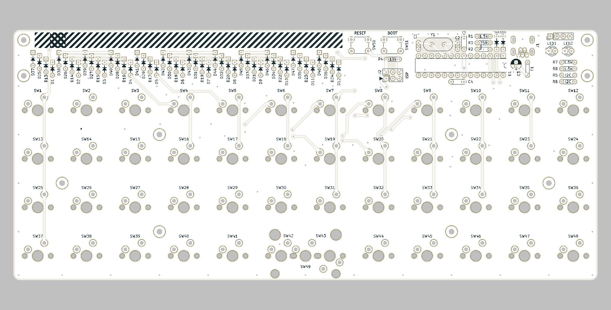

# Plaid // Through hole docs

## Assembly (en)
1. [Check BOM(parts list)](./en/BOM.md)
2. [Solder components, excluding switches](./en/soldering.md)
3. [Bootloader](./en/bootloader.md)
4. [Firmware](./en/firmware.md)
5. [Solder switches and complete](./en/complete.md)
